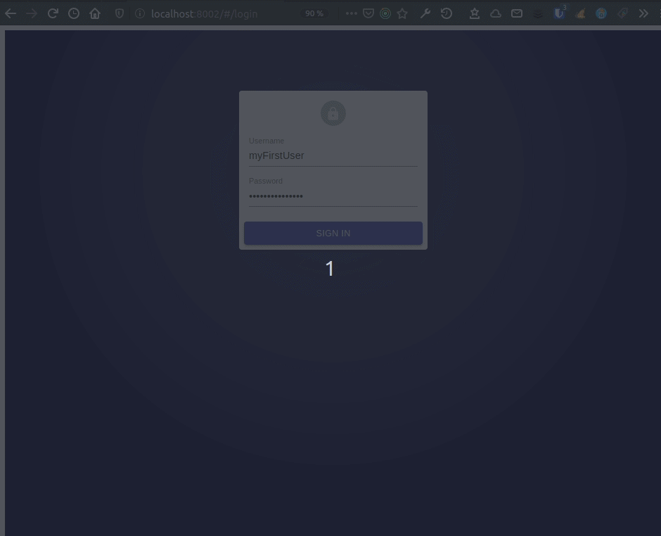
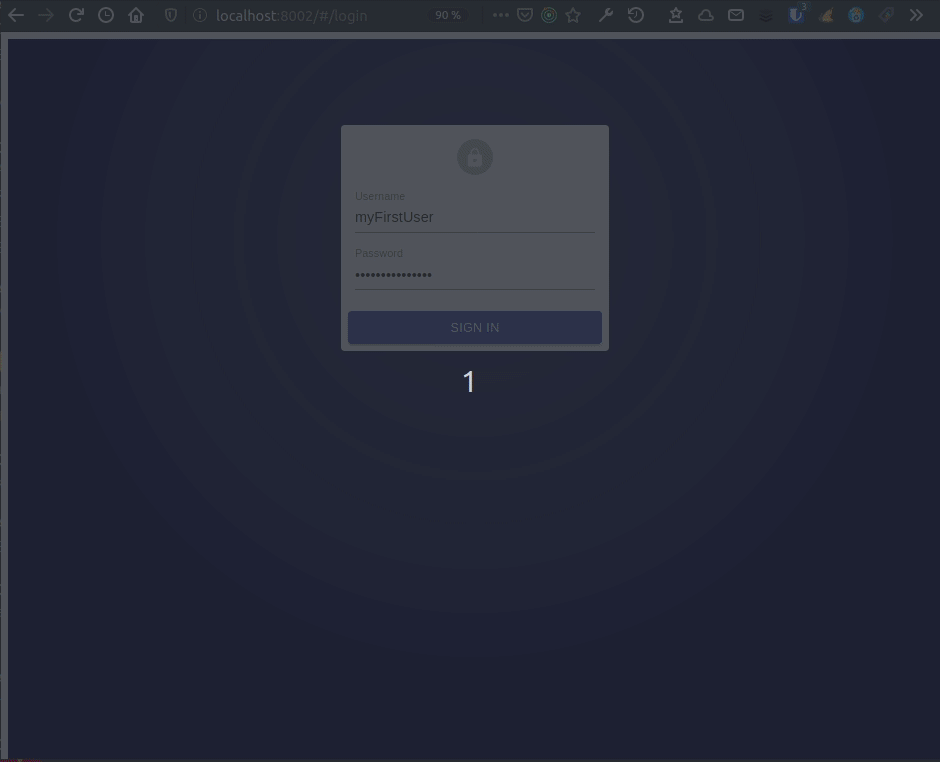

Afin de sécuriser au mieux l'authentification de React-admin, voyons comment stocker un Json Web Token en mémoire plutôt que dans le localStorage du navigateur.

React-admin s'appuie sur un très efficace [authProvider](https://marmelab.com/react-admin/Authentication.html) pour gérer l'authentification. Et sans doute par habitude ou mimétisme, on utilise souvent sur un [JSON Web Token(JWT)](https://tools.ietf.org/html/rfc7519) pour transmettre cette authentification entre React-admin et l'API, JWT que l'on stocke ensuite par commodité dans le [localStorage](https://developer.mozilla.org/en-US/docs/Web/API/Window/localStorage) du navigateur. Mais ce n'est pourtant pas une bonne pratique, comme l'explique par exemple Randall Degges dans son article ["Please Stop Using Local Storage"](https://dev.to/rdegges/please-stop-using-local-storage-1i04). Et pour le plus curieux, voici par exemple comment ["Stealing JWTs in localStorage via XSS"](https://medium.com/redteam/stealing-jwts-in-localstorage-via-xss-6048d91378a0).

Mais alors comment utiliser un JWT pour gérer son authentification React-admin de manière plus sécurisée ? Ce post de blog va illustrer une implémentation du principe proposé par l'équipe d'[Hasura](https://hasura.io) dans leur article [The Ultimate Guide to handling JWTs on frontend clients](https://hasura.io/blog/best-practices-of-using-jwt-with-graphql/). Ce principe consiste "tout simplement" à stocker ce jeton en mémoire.

Ce qui n'est pas si simple en fait !

## Première mise en place

Partons du postulat que l'on a une API possédant une route d'authentification qui en cas de succès retournera un JWT. Voici un exemple d'une telle implémentation avec [Koa](https://koajs.com/) et  [node-jsonwebtoken](https://github.com/auth0/node-jsonwebtoken#readme) :

```javascript
router.post('/authenticate', async (ctx) => {
    const { username, password } = ctx.request.body;

    const user = await getOneByUsername(username);

    if (!user || user.error) {
        ctx.throw(401, user ? user.error : 'Invalid credentials.');
        return;
    }

    if (!bcrypt.compareSync(password, user.password)) {
        ctx.throw(401, 'Invalid credentials.');
        return;
    }

    const token = jwt.sign({ username }, config.security.jwt.secretkey, {
        expiresIn: config.security.jwt.expiration,
    });

    ctx.body = {
        token: token,
        tokenExpiry: config.security.jwt.expiration,
    };
});

```

> Ici le code est minimal, vous pourrez trouver un exemple plus complet dans le code de la démo sur le dépôt de [ra-in-memory-jwt](https://github.com/marmelab/ra-in-memory-jwt/tree/master/demo).

Et voici une première version de `ra-in-memory-jwt` qui va nous servir à stocker le jeton obtenu lors de l'authentification, en mémoire, et non pas dans le `localStorage` :

```javascript
// inMemoryJwt.js
const inMemoryJWTManager = () => {
    let inMemoryJWT = null;

    const getToken = () => inMemoryJWT;

    const setToken = (token) => {
        inMemoryJWT = token;
        return true;
    };

    const ereaseToken = () => {
        inMemoryJWT = null;
        return true;
    }

    return {
        ereaseToken,
        getToken,
        setToken,
    }
};

export default inMemoryJWTManager();
```

On profite donc d'une [closure](https://developer.mozilla.org/en-US/docs/Web/JavaScript/Closures) pour instancier la variable `inMemoryJWT` qui portera en mémoire notre JWT, puisque l'on execute la fonction inMemoryJWTManager lors de l'export.

Voyons maintenant comment utiliser ce `inMemoryJWTManager` dans une application React-admin basique. Tout d'abord, nous déclarons une application `App` :

```javascript
// App.js
import React from 'react';
import { Admin, Resource } from 'react-admin';

import myDataProvider from './dataProvider';
import authProvider from './authProvider';
import usersConfiguration from './users';

const dataProvider = myDataProvider('http://localhost:8001/api');
const App = () => (
    <Admin authProvider={authProvider} dataProvider={dataProvider}>
        <Resource name="users" {...usersConfiguration} />
    </Admin>
);

export default App;
```

Ensuite, il faut configurer le fournisseur d'authentification, le `authProvider` :

```javascript
// in authProvider.js
import inMemoryJWT from 'ra-in-memory-jwt';

const authProvider = {
    login: ({ username, password }) => {
        const request = new Request('http://localhost:8001/authenticate', {
            method: 'POST',
            body: JSON.stringify({ username, password }),
            headers: new Headers({ 'Content-Type': 'application/json' })
        });
        return fetch(request)
            .then((response) => {
                if (response.status < 200 || response.status >= 300) {
                    throw new Error(response.statusText);
                }
                return response.json();
            })
            .then(({ token }) => inMemoryJWT.setToken(token));
    },
    logout: () => {
        inMemoryJWT.ereaseToken();
        return Promise.resolve();
    },

    checkAuth: () => {
        return inMemoryJWT.getToken() ? Promise.resolve() : Promise.reject();
    },

    checkError: (error) => {
        const status = error.status;
        if (status === 401 || status === 403) {
            inMemoryJWT.ereaseToken();
            return Promise.reject();
        }
        return Promise.resolve();
    },

    getPermissions: () => {
        return inMemoryJWT.getToken() ? Promise.resolve() : Promise.reject();
    },
};

export default authProvider;
```

Puis il faut configurer le fournisseur de données, le `dataProvider`. En effet, c'est ce `dataProvider` qui se chargera de transmettre le JWT à l'API, via un en-tête http `Authorization` :

```javascript
// in dataProvider.js
import { fetchUtils } from 'ra-core';
import inMemoryJWT from 'ra-in-memory-jwt';

export default (apiUrl) => {
    const httpClient = (url) => {
        const options = {
            headers: new Headers({ Accept: 'application/json' }),
        };
        const token = inMemoryJWT.getToken();
        if (token) {
            options.headers.set('Authorization', `Bearer ${token}`);
        }

        return fetchUtils.fetchJson(url, options);
    };

    return {
        getList: (resource, params) => {
            const url = `${apiUrl}/${resource}`;
            return httpClient(url).then(({ headers, json }) => {
                return {
                    data: json,
                    total: headers.get('x-total-count'),
                };
            });
        },
        getOne: (resource, params) =>
            httpClient(`${apiUrl}/${resource}/${params.id}`).then(({ json }) => ({
                data: json,
            })),
        getMany: () => Promise.reject(),
        getManyReference: () => Promise.reject(),
        update: () => Promise.reject(),
        updateMany: () => Promise.reject(),
        create: () => Promise.reject(),
        delete: () => Promise.reject(),
        deleteMany: () => Promise.reject(),
    };
};
```

Notre application est d'hors et déjà fonctionnelle et sécurisée. Le JWT n'est en effet plus visible dans le `localStorage` du navigateur. Mais l'expériences utilisateur n'est pas extraordinaire !

Par exemple, lorsque l'on recharge la page :


Ou bien lorsque l'on se déconnecte d'un onglet alors que l'on est aussi connecté sur un second :


## Le problème des onglets

Lorsque le JWT est stocké dans le `localStorage`, deux sessions de React-admin lancées dans deux onglets du navigateur vont pouvoir se partager ce JWT. Et lorsque l'on se déconnecte, la suppression du JWT dans le `localStorage` va donc impacter les deux onglets.

Ce n'est plus la cas lorsque le JWT est stocké en mémoire, ou chaque instance de React-admin va gérer le stockage du JWT indépendamment l'une de l'autre.

La solution proposer dans l'article [The Ultimate Guide to handling JWTs on frontend clients](https://hasura.io/blog/best-practices-of-using-jwt-with-graphql/) est assez maligne, et passe par ... le `localStorage` :)

```javascript
// inMemoryJwt.js
const inMemoryJWTManager = () => {
    let inMemoryJWT = null;

    // This listener will allow to disconnect a session of ra started in another tab
    window.addEventListener('storage', (event) => {
        if (event.key === 'ra-logout') {
            inMemoryJWT = null;
        }
    });

    const getToken = () => inMemoryJWT;

    const setToken = (token) => {
        inMemoryJWT = token;
        return true;
    };

    const ereaseToken = () => {
        inMemoryJWT = null;
        window.localStorage.setItem('ra-logout', Date.now());
        return true;
    }

    return {
        ereaseToken,
        getToken,
        setToken,
    }
};

export default inMemoryJWTManager();
```

Ainsi, lorsque l'utilisateur se déconnecte depuis un onglet, il génère un évènement sur la clé `ra-logout` du `localStorage`, évènement écouté par toutes les instances de `inMemoryJWT`.

## Gérer une session sur un durée de vie plus longue que celle du token

Un principe important lors de la sécurisation des JWT est d'avoir des tokens ayant une durée de vie limitée. Disons 5 min. Ainsi, si malgré tout nos effort ce jeton est volé, il ne sera pas valide très longtemps.

Donc, même si l'utilisateur ne recharge pas sa page, la session cessera lorsque le token ne sera plus valide. Ce qui implique des sessions utilisateurs très courtes.

Comment étendre cette durée de session ? Et bien avec un cookie ! Mais ici, nous utiliserons un cookie très sécurisé ([httpOnly](https://developer.mozilla.org/en-US/docs/Web/HTTP/Cookies#Secure_and_HttpOnly_cookies), [SameSite](https://web.dev/samesite-cookies-explained/), etc ...) qui va nous permettre d'obtenir un nouveau JWT avant que le JWT courant ne soit périmé !

Cela va tout d'abord induire du code supplémentaire coté back pour :

1. Recevoir en plus du token sa durée de vie lors de la connexion. Nous pourrions le faire en décodant le token coté front, mais cela implique manipulation inutile !
2. De poser un cookie `refresh-token` lors de l'authentification

En effet, ce token va nous permettre d'interroger une nouvelle route à mettre en place côté API : la route `/refresh-token`. Lorsque le front va interroger cette route, et dans le cas ou le `refresh-token` est valide, cette route va renvoyer un nouveau token qui pourra remplacer en mémoire le token périmé.

Je ne détaille pas ici le détail de l'implémentation côté API, mais vous pourrez trouver un exemple plus complet dans le code de la démo sur le dépôt de [ra-in-memory-jwt](https://github.com/marmelab/ra-in-memory-jwt/tree/master/demo)

Par contre, voyons comment cela va fonctionner du côté de l'application React-admin.

```javascript
const inMemoryJWTManager = () => {
    let logoutEventName = 'ra-logout';
    let refreshEndpoint = '/refresh-token';
    let inMemoryJWT = null;
    let refreshTimeOutId;

    // This listener will allow to disconnect a session of ra started in another tab
    window.addEventListener('storage', (event) => {
        if (event.key === logoutEventName) {
            inMemoryJWT = null;
        }
    });

    const setRefreshTokenEndpoint = endpoint => refreshEndpoint = endpoint;

    // This countdown feature is used to renew the JWT in a way that is transparent to the user.
    // before it's no longer valid
    const refreshToken = (delay) => {
        refreshTimeOutId = window.setTimeout(
            getRefreshedToken,
            delay * 1000 - 5000
        ); // Validity period of the token in seconds, minus 5 seconds
    };

    const abordRefreshToken = () => {
        if (refreshTimeOutId) {
            window.clearTimeout(refreshTimeOutId);
        }
    };

    // The method make a call to the refresh-token endpoint
    // If there is a valid cookie, the endpoint will return a fresh jwt.
    const getRefreshedToken = () => {
        const request = new Request(refreshEndpoint, {
            method: 'GET',
            headers: new Headers({ 'Content-Type': 'application/json' }),
            credentials: 'include',
        });
        return fetch(request)
            .then((response) => {
                if (response.status !== 200) {
                    ereaseToken();
                    global.console.log(
                        'Failed to renew the jwt from the refresh token.'
                    );
                    return { token: null };
                }
                return response.json();
            })
            .then(({ token, tokenExpiry }) => {
                if (token) {
                    setToken(token, tokenExpiry);
                    return true;
                }

                return false;
            });
    };


    const getToken = () => inMemoryJWT;

    const setToken = (token, delay) => {
        inMemoryJWT = token;
        refreshToken(delay);
        return true;
    };

    const ereaseToken = () => {
        inMemoryJWT = null;
        abordRefreshToken();
        window.localStorage.setItem(logoutEventName, Date.now());
        return true;
    }

    const setLogoutEventName = name => logoutEventName = name;

    return {
        ereaseToken,
        getToken,
        setLogoutEventName,
        setRefreshTokenEndpoint,
        setToken,
    }
};

export default inMemoryJWTManager();
```

```javascript
//in authProvider.js
//...
const authProvider = {
    login: ({ username, password }) => {
        const request = new Request('http://localhost:8001/authenticate', {
            method: 'POST',
            body: JSON.stringify({ username, password }),
            headers: new Headers({ 'Content-Type': 'application/json' }),
            credentials: 'include',
        });
        inMemoryJWT.setRefreshTokenEndpoint('http://localhost:8001/refresh-token');
        return fetch(request)
            .then((response) => {
                if (response.status < 200 || response.status >= 300) {
                    throw new Error(response.statusText);
                }
                return response.json();
            })
            .then(({ token, tokenExpiry }) => inMemoryJWT.setToken(token, tokenExpiry));
    },
//...
```

L'idée est assez simple : on récupère la durée de vie en même temps que le token et on lance un compte-à-rebours (timeout) sur la fonction qui va appeler la route `/refresh-token` 5 secondes avant le péremption du token. Cette route fonctionnera durant toute la durée de vie du cookie créé lors de l'authentification. C'est donc ce cookie qui déterminera la durée d'une session de connexion.


## La session

Le mécanisme que l'on vient de voir permet d'avoir une session authentifiée plus longue que la durée de vie du JWT. Mais il ne permet pas de maintenir une session, par exemple si l'on rafraichie la page !

Pour parvenir à ce résultat, il devrait suffire de faire un appel à la route `/refresh-token` lorsque l'on test les droits de l'utilisateur (le `checkAuth` de l'`authProvider`):

```javascript
//in authProvider.js
//...
    checkAuth: () => {
        console.log('checkAuth');
        if (!inMemoryJWT.getToken()) {
            inMemoryJWT.setRefreshTokenEndpoint('http://localhost:8001/refresh-token');
            return inMemoryJWT.getRefreshedToken().then(tokenHasBeenRefreshed => {
                return tokenHasBeenRefreshed ? Promise.resolve() : Promise.reject();
            });
        } else {
            return Promise.resolve();
        }
    },
```

Cette solution fonctionne. Mais elle n'est pas pour autant très satisfaisante :



En effet, React-admin, pour des raisons d'[optimistic rendering](https://medium.com/@whosale/optimistic-and-pessimistic-ui-rendering-approaches-bc49d1298cc0), va lancer l'appel à la vue courante (dans notre exemple, une vue liste) **avant** le retour de la promesse de `checkAuth`.
Du coup, cet appel se fera sans le JWT, avec un retour en `403`, entrainant une redirection vers la page d'authentification par la méthode `checkError` de l'`authProvider`. Par contre, la page d'authentification va elle "profiter" du retour du JWT, et va donc ... rediriger vers la vue d'origine.

Plusieurs solution sont possibles pour résoudre ce problème en fonction de votre besoin.

En effet, on pourrait imaginer que certaine route n'aient pas besoin de jeton JWT, comme les listes. C'est la cas si vous utilisez React-admin pour afficher les vues de consultation (le `list` et le `show`) publiquement.

Mais pour notre exemple, on considère que ce n'est pas le cas et que toute les routes nécessitent une authentification. Toutes les routes ayant besoin d'un token pour fonctionner, nous allons donc implémenter l'appel à la route `refresh-token` directement au niveau du client http :

```javascript
// in dataProvider

const httpClient = (url) => {
    const options = {
        headers: new Headers({ Accept: 'application/json' }),
    };
    const token = inMemoryJWT.getToken();

    if (token) {
        options.headers.set('Authorization', `Bearer ${token}`);
        return fetchUtils.fetchJson(url, options);
    } else {
        inMemoryJWT.setRefreshTokenEndpoint('http://localhost:8001/refresh-token');
        return inMemoryJWT.getRefreshedToken().then((gotFreshToken) => {
            if (gotFreshToken) {
                options.headers.set('Authorization', `Bearer ${inMemoryJWT.getToken()}`);
            };
            return fetchUtils.fetchJson(url, options);
        });
    }
};

```

Cela résout notre premier problème d'appel à la liste qui renvoyait une `403`. Mais cela provoque un second problème : le `getPermissions` n'ayant pas de token, cela va aussi provoquer une déconnexion et une redirection vers l'authentification.

En fait, on a globalement un problème de concurrence entre les méthodes dépendantes du JWT, toutes ces méthodes pouvant avoir besoin de lancer un appel asynchrone à la route de rafraichissement du jeton !

La solution va consister à demander à ces méthodes du `authProvider` d'attendre la fin d'une éventuelle requête vers la route `/refresh-token` lancée par le `dataProvider` avant de retourner leur réponse.

Et pour cela, on implémente une méthode `waitForTokenRefresh` au niveau du `inMemoryJWTManager`.

Cette méthode retourne une promesse résolue si aucun appel vers le `refresh-token` n'est en cours. Si un appel est en cours, elle attend la résolution de cet appel avant de renvoyer la résolution de la promesse.

```javascript
// in inMemoryJWTManager

const inMemoryJWTManager = () => {
    ...
    let isRefreshing = null;

    ...

    const waitForTokenRefresh = () => {
        if (!isRefreshing) {
            return Promise.resolve();
        }
        return isRefreshing.then(() => {
            isRefreshing = null;
            return true;
        });
    }

    const getRefreshedToken = () => {
        const request = new Request(refreshEndpoint, {
            method: 'GET',
            headers: new Headers({ 'Content-Type': 'application/json' }),
            credentials: 'include',
        });

        isRefreshing = fetch(request)
            .then((response) => {
                if (response.status !== 200) {
                    ereaseToken();
                    global.console.log(
                        'Token renewal failure'
                    );
                    return { token: null };
                }
                return response.json();
            })
            .then(({ token, tokenExpiry }) => {
                if (token) {
                    setToken(token, tokenExpiry);
                    return true;
                }
                ereaseToken();
                return false;
            });

        return isRefreshing;
    };

    ...
};
```

La méthode `waitForTokenRefresh` est donc implémentée au sein de l'`authProvider` :

```javascript
// in authProvider.js
    ...

    checkAuth: () => {
        return inMemoryJWT.waitForTokenRefresh().then(() => {
            return inMemoryJWT.getToken() ? Promise.resolve() : Promise.reject();
        });
    },

    ...

    getPermissions: () => {
        return inMemoryJWT.waitForTokenRefresh().then(() => {
            return inMemoryJWT.getToken() ? Promise.resolve() : Promise.reject();
        });
    },
```



## La déconnexion

Le dernier point à adresser touche à la déconnexion. En effet, avec notre nouveau mécanisme, la déconnexion marche pour le session courante. Mais dès que l'on recharge la page, nous somme de nouveau connecté ! La seule solution consiste à appeler une **route de déconnexion** de l'API, car seule l'API pourra invalider le cookie de rafraichissement !.

```javascript
// in authProvider.js

    logout: () => {
        const request = new Request('http://localhost:8001/logout', {
            method: 'GET',
            headers: new Headers({ 'Content-Type': 'application/json' }),
            credentials: 'include',
        });
        inMemoryJWT.ereaseToken();

        return fetch(request).then(() => '/login');
    },
```

## Conclusion

Le code décrit dans ce post permet de gérer une authentification React-admin basée sur l'utilisation d'un Json Web Token de manière bien sécurisée, el le stockant en mémoire, sans être au détriment du confort de l'utilisateur.

Est-ce que pour autant `ra-in-memory-jwt` est amené à devenir une partie incontournable de l'écosystème React-admin ?

J'aimerais bien car j'avoue que cela flatterait un peu mon égo. Mais je suis persuadé que ce n'est pas souhaitable !

En effet, son utilisation apporte beaucoup de complexité. Une complexité que je soupçonne d'être inutile dans bien des cas ! Il faut se poser la bonne question : **à quel besoin répond l'utilisation d'un Json Web Token pour gérer l'authentification de mon application React-admin (ou non basée sur React-admin d'ailleurs) ?**

Si vous interagissez par exemple avec un gros système de micro-services qui utilisera ce JWT pour partager l'authentification de l'utilisateur entre les différents services, alors oui, il est possible que vous ayez intérêt à vous pencher sur `ra-in-memory-jwt`.

Par contre, si votre application React-admin interagit avec une API plus monolithique, il y a de fortes chances pour que votre authentification n'est pas besoin de plus qu'un bon cookie. Pour peu que vous appliquiez les mêmes bonnes pratiques de sécurité que celles utilisées par le cookie décrit dans ce post gérant la route de `refresh-token`.
