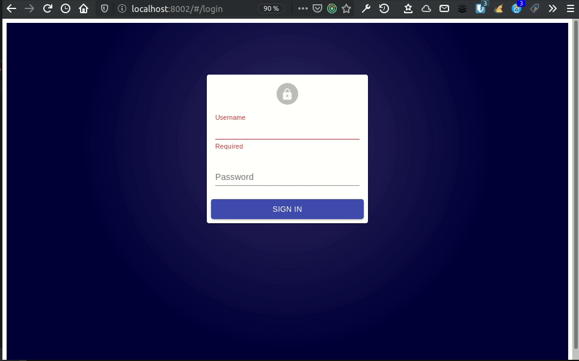
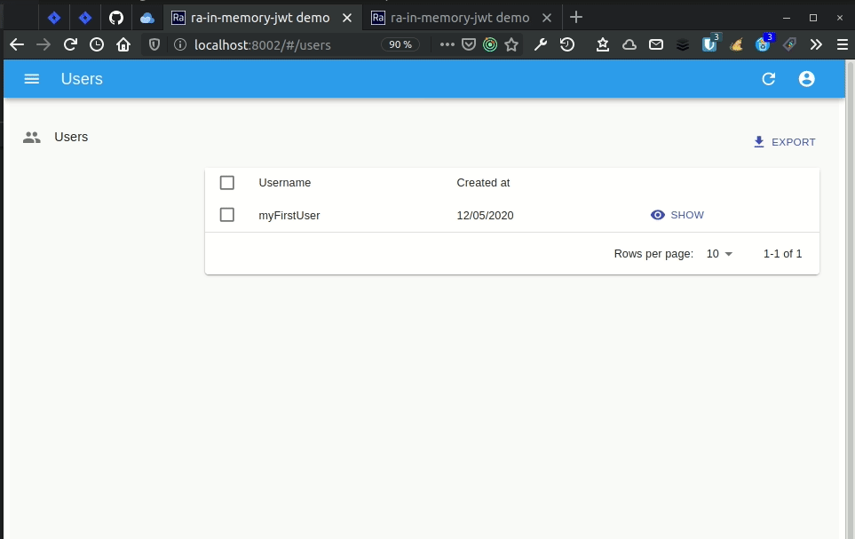

On utilise très régulièrement les [JSON Web Token(JWT)](https://tools.ietf.org/html/rfc7519) pour gérer l'authentification des utilisateurs. Et c'est par exemple la manière dont est illustrer l'authentification dans la documentation de React-admin.

Mais dans cette exemple, le JWT est stocker dans le locale storage. Ce qui pour certain est considérer comme une très mauvaise pratique !

[How to securely store JWT tokens.](https://dev.to/gkoniaris/how-to-securely-store-jwt-tokens-51cf)


Cette article illustre l'implementation décrit dans le post de blog [The Ultimate Guide to handling JWTs on frontend clients](https://hasura.io/blog/best-practices-of-using-jwt-with-graphql/) qui consiste à ne plus stocker le JWT dans le local storage, mais en mémoire. Ce qui n'est pas fait pour simpleifier une implémentation user friendly !

Ce qu'il faut retenir de cette implementation, c'est que l'on considère que la meilleur manière de conserver le JWT côté client est de la conserver en mémoire. C'est ainsi qu'on minimisera au maximum le vol potentiel de ce jeton, jeton qui aura au demeurant une durée de vie assez courte (10 min). Mais pour pallier aux inconveniants de ne le maintenir qu'en mémoire (on perd le jeton en rafraichissant la page par exemple !), on va implémenter un mécanisme permettant de renouveller ce jeton en se basant sur un endpoint (`/refresh-token`) qui utilisera un cookie qui lui sera sécurisé. La table `refresh_token` est la table utilisée pour gérer ces jetons de rafraichissement de JWT.

## Première mise en place

On considère donc que l'on a une API possédant une route s'authentification qui en cas de succès retournera un JWT. Voici un exemple d'une tel implementation avec [Koa](https://koajs.com/) et  [node-jsonwebtoken](https://github.com/auth0/node-jsonwebtoken#readme) :

```javascript
router.post('/authenticate', async (ctx) => {
    const { username, password } = ctx.request.body;

    const user = await getOneByUsername(username);

    if (!user || user.error) {
        ctx.throw(401, user ? user.error : 'Invalid credentials.');
        return;
    }

    if (!bcrypt.compareSync(password, user.password)) {
        ctx.throw(401, 'Invalid credentials.');
        return;
    }

    const token = jwt.sign({ username }, config.security.jwt.secretkey, {
        expiresIn: config.security.jwt.expiration,
    });

    ctx.body = { token };
});

```

Et voici une première version de `ra-in-memory-jwt` qui va nous servir à stocker le jeton post authentification, en mémoire, et non plus dans le local storage :

```javascript
// inMemoryJwt.js
const inMemoryJWTManager = () => {
    let inMemoryJWT = null;

    const getToken = () => inMemoryJWT;

    const setToken = (token) => {
        inMemoryJWT = token;
        return true;
    };

    const ereaseToken = () => {
        inMemoryJWT = null;
        return true;
    }

    return {
        ereaseToken,
        getToken,
        setToken,
    }
};

export default inMemoryJWTManager();
```

Et voici son implementation dans une application react-admin basique :

l'application principale :

```javascript
// App.js
import React from 'react';
import { Admin, Resource } from 'react-admin';

import myDataProvider from './dataProvider';
import authProvider from './authProvider';
import usersConfiguration from './users';

const dataProvider = myDataProvider('http://localhost:8001/api');
const App = () => (
    <Admin authProvider={authProvider} dataProvider={dataProvider}>
        <Resource name="users" {...usersConfiguration} />
    </Admin>
);

export default App;
```

La gestion de l'authentification :

```javascript
// in authProvider.js
import inMemoryJWT from 'ra-in-memory-jwt';

const authProvider = {
    login: ({ username, password }) => {
        const request = new Request('http://localhost:8001/authenticate', {
            method: 'POST',
            body: JSON.stringify({ username, password }),
            headers: new Headers({ 'Content-Type': 'application/json' })
        });
        return fetch(request)
            .then((response) => {
                if (response.status < 200 || response.status >= 300) {
                    throw new Error(response.statusText);
                }
                return response.json();
            })
            .then(({ token }) => inMemoryJWT.setToken(token));
    },
    logout: () => {
        inMemoryJWT.ereaseToken();
        return Promise.resolve();
    },

    checkAuth: () => {
        return inMemoryJWT.getToken() ? Promise.resolve() : Promise.reject();
    },

    checkError: (error) => {
        const status = error.status;
        if (status === 401 || status === 403) {
            inMemoryJWT.ereaseToken();
        }
        return Promise.resolve();
    },

    getPermissions: () => {
        return inMemoryJWT.getToken() ? Promise.resolve() : Promise.reject();
    },
};

export default authProvider;
```

La gestion des appels à l'API

```javascript
// in dataProvider.js
import { fetchUtils } from 'ra-core';
import inMemoryJWT from 'ra-in-memory-jwt';

export default (apiUrl) => {
    const httpClient = (url) => {
        const options = {
            headers: new Headers({ Accept: 'application/json' }),
        };
        const token = inMemoryJWT.getToken();
        if (token) {
            options.headers.set('Authorization', `Bearer ${token}`);
        }

        return fetchUtils.fetchJson(url, options);
    };

    return {
        getList: (resource, params) => {
            const url = `${apiUrl}/${resource}`;
            return httpClient(url).then(({ headers, json }) => {
                return {
                    data: json,
                    total: headers.get('x-total-count'),
                };
            });
        },
        getOne: (resource, params) =>
            httpClient(`${apiUrl}/${resource}/${params.id}`).then(({ json }) => ({
                data: json,
            })),
        getMany: () => Promise.reject(),
        getManyReference: () => Promise.reject(),
        update: () => Promise.reject(),
        updateMany: () => Promise.reject(),
        create: () => Promise.reject(),
        delete: () => Promise.reject(),
        deleteMany: () => Promise.reject(),
    };
};
```

Cela marche très bien. C'est très securisé, on ne voit pas le JWT dans le local storage. Mais l'experience utilisateur n'est pas extraordinaire !

Par exemple, lorsque l'on refresh la page :



Ou bien lorsque l'on se deconnecte d'un tab alors que l'on est aussi connecter sur une seconde :

